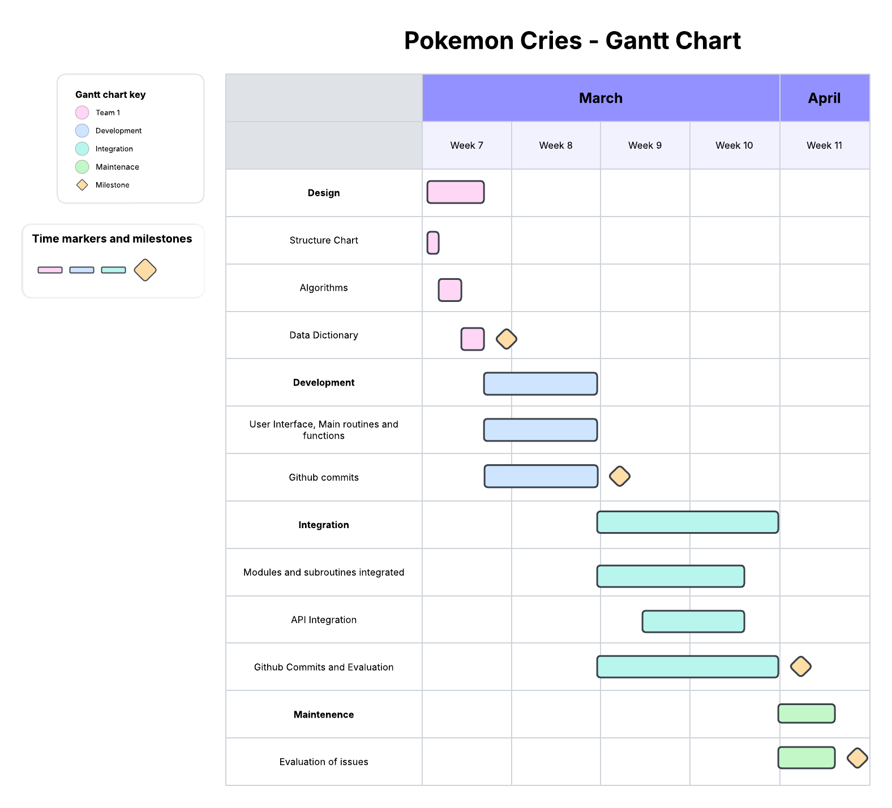

# Year 10 Software Engineering Documentation
**API** \
https://pokeapi.co/

## Requirements Definition

### Functional Requirements
**Data Retrieval** 
* The user has to be able to see a text box that the user will need to enter a pokemon name. 
* The user will also need to see the link of the sound file of the pokemon. 
* The user should be able to store the pokemon and go back to the sound.

**User Interface**
* The user has to type in pokemon names that they are interested in. 
* If there is enough time, there might be a GUI with buttons instead of typing to lower user error. 

**Data Display**
* After the user inputs the name of a pokemon, it will play the pokemons cry. 
* If the pokemon does not exist or the user inputs a error, it will play 10 random pokemon's cry at the same time.

### Non-Functional Requirements

**Performance**
* The system should perform decently well with little to no delays in the system. 
* The system should not freeze or crash unless the user is messing around.

**Reliablilty**
* The data is really reliable as the API is used by thousands of people each month. 
* The system should run reliably with little to no crashes and breaks in the code. 
* It should not break with a error by user input.

**Usability and Accessibility**
* The system should have easy to follow instructions that anyone can understand and follow. 
* It should be easy to navigate and follow.

## Determining Specifications

### Functional Specifications

**User Requirements**
* The user needs to be able to input words & phrases when asked a question in the code
* The user needs to be able to hear sound playing
* The user needs to be able to intereact with the system through commands and responses 

**Inputs and Outputs**
* The user will need to input the name of a pokemon
* The user will hear a sound output of the pokemon selected
* If the pokemon does not exist, the user will need to hear sound output of 10 differnt pokemon 
* The user will be able to store the pokemon and go back to in later in the program.

**Core Features**
* The program needs to request from the pokemon api
* The program needs to ask users for a pokemon name
* The program needs to store the user's pokemon
* The program needs to pull from the api
* The program needs to store a pokemon
* The program needs to play the sound of the pokemon stored 

**User Interaction**
* The user will interact with the system via line command
* If time allows it, there might be a GUI
* A README.md file will contain all instructions on how to run the application and any dependencies
* A txt file will contain the requirements for the system to function i.e Windows 

**Error Handleing**
* If the user inputs a pokemon that does not exist or a number/symbol, then the system will output 10 random pokemon sounds at the same time.
* It it is a system error, it will most likely be fixed upon release. However, if the error is not fixed, it will play 10 random pokemon sounds at the same time

### Non-Functional Specifications

**Performance**
* The system should run programs within seconds
* The system should not lag or take to long to process inputs and outputs to maintain user engagement
* To make the system more efficient, classes and functions will be used to minimise the repetition of code in the program.

**Useability / Accessibility**
* The program should be easy to read and simple when asking for user interaction
* It should avoid unnessisary interactions with the user.
* Simple terms should be used to make the system easier to understand

**Reliability**
* The system should not crash
* If an error occures, the system will output 10 different pokemon sounds 

### Use Cases
**Actor**
* User

**Preconditions**
* Access to the internet
* API of pokemon is available
* Pip installed
* Playsound installed
* Pygame installed

**Main Flow**
* *Search of pokemon* - User eners the name of their pokemon and the system retreives the sound of the pokemon from the api
* *Sound display* - It will output the pokemon's cry
* *Pokemon Storage* - It will store the pokemon
* *Storeage output* - It will output stored pokemon sounds

**Alternative Flows**
* *Error* - If the pokemon does not exist, it will output 10 random pokemon cries

**Postconditions**
* The name of the pokemon is retreived
* The cry of the pokemon is outputed

## Design

### Gantt Chart

### Structure Chart

### Algorithms - Flowchart
**Main**
.png "")
**Play Sound**